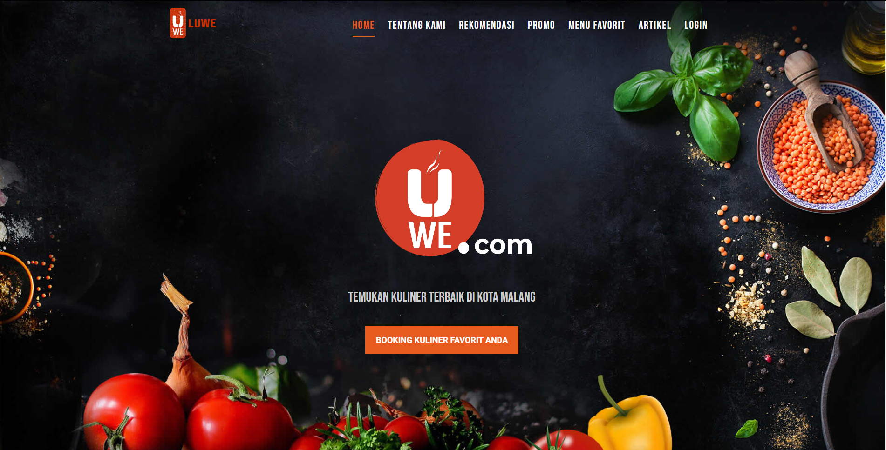
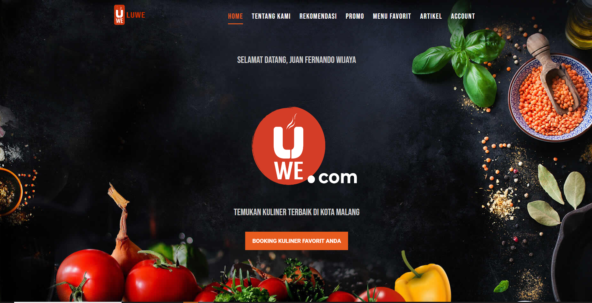
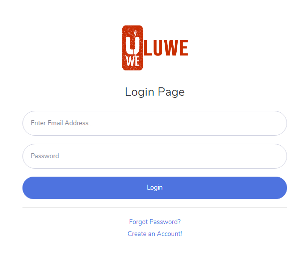
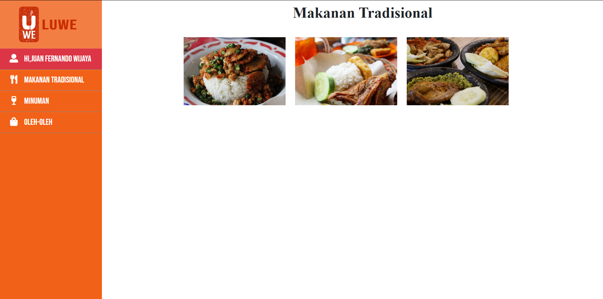
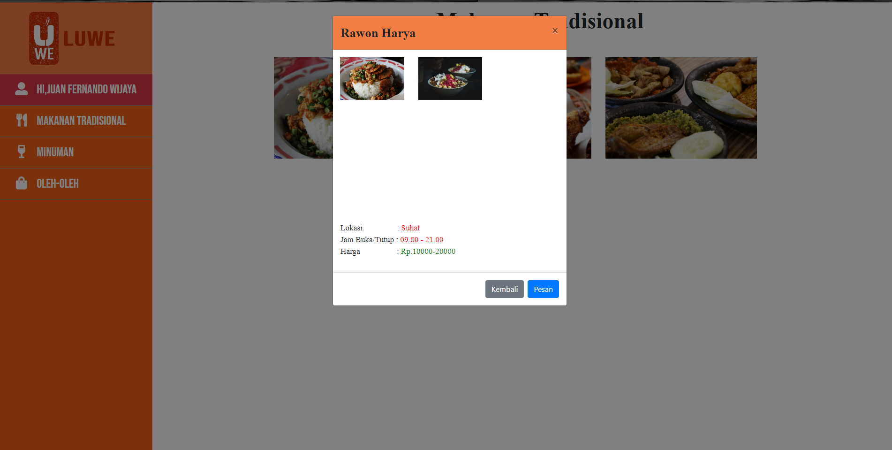
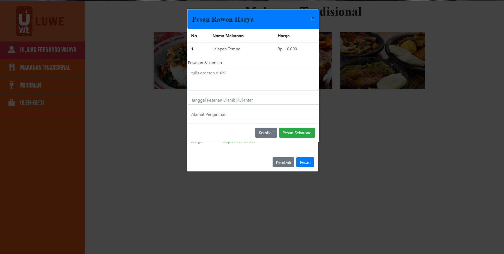
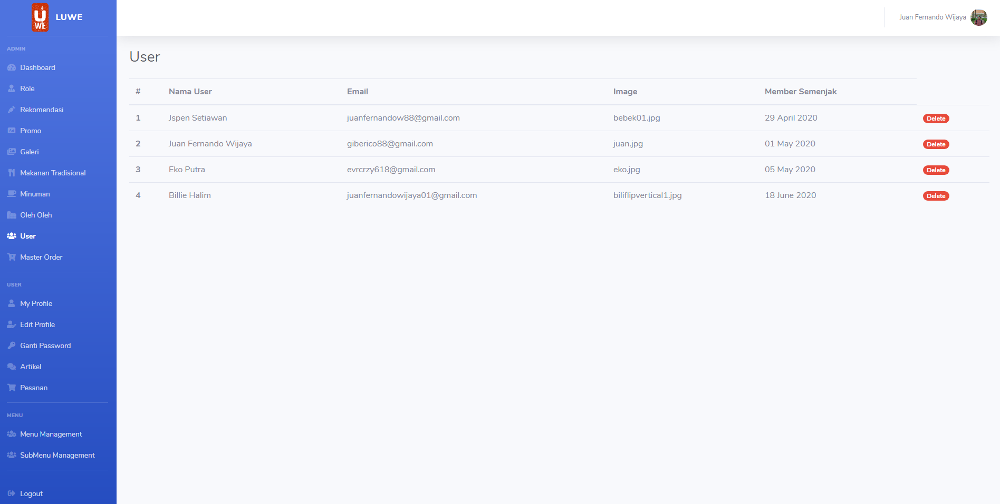
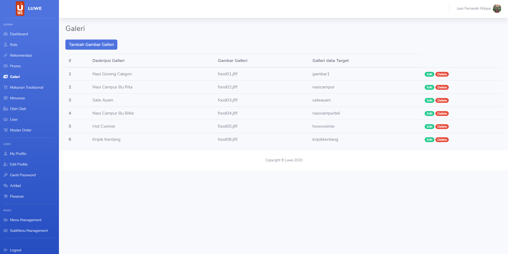
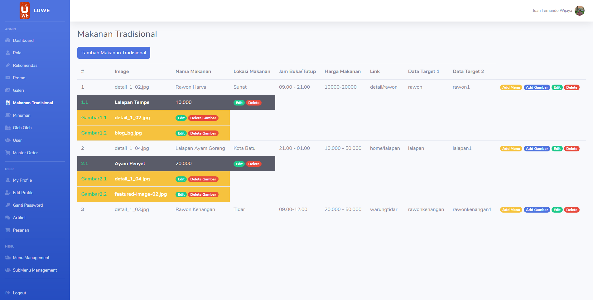
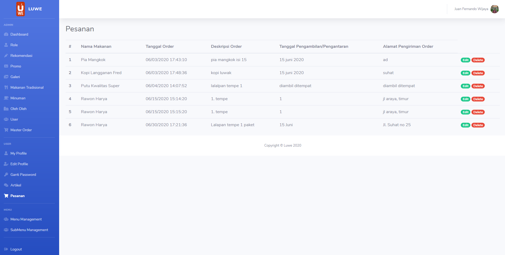

## Luwe

Luwe adalah aplikasi kuliner yang berasal dari malang
yang bertujuan untuk memudahkan masyarakat yang berasal dari luar malang
untuk mencari dan melakukan booking kuliner dengan mudah

*******************
## Teknologi yang Digunakan
*******************

-  HTML
-  CSS
-  PHP
-  Code Igniter 3
-  Bootstrap
**************************
## Apa yang saya pelajari
**************************

- Membuat web dengan menggunakan framework codeigniter 3.
- Membuat dan mengatur tampilan web dengan css dan bootstrap.
- Mengatur dan menyesuaikan tampilan Web sesuai dengan MOCKUP.

*******************
## Screen Shoot
*******************
#### Landing Page

#### Home After Login

#### Login

#### Order Page

#### Order Page Select Menu & Preview Image

#### Order Form

#### Menu Admin 1

#### Menu Admin 2

#### Menu Admin 3

#### Menu Admin 4

